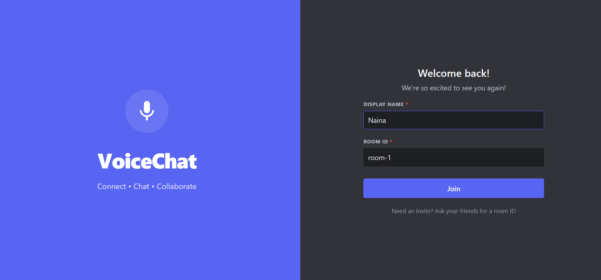
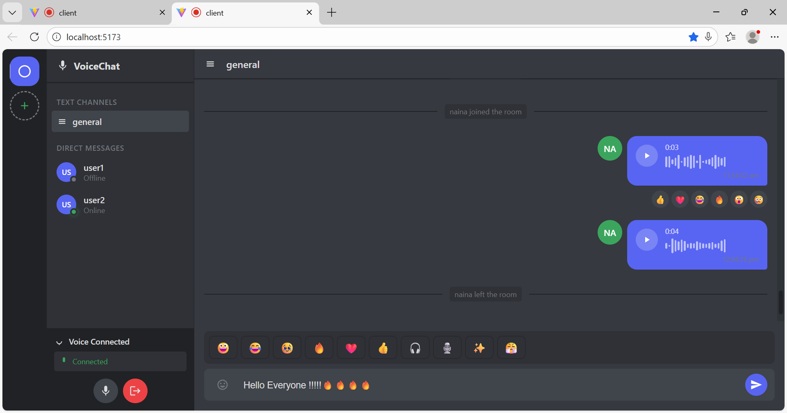
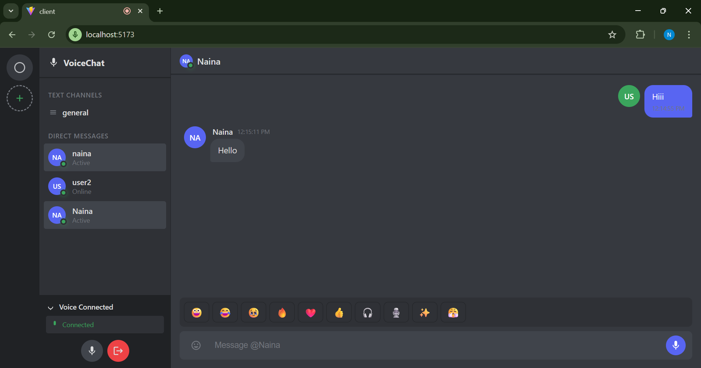
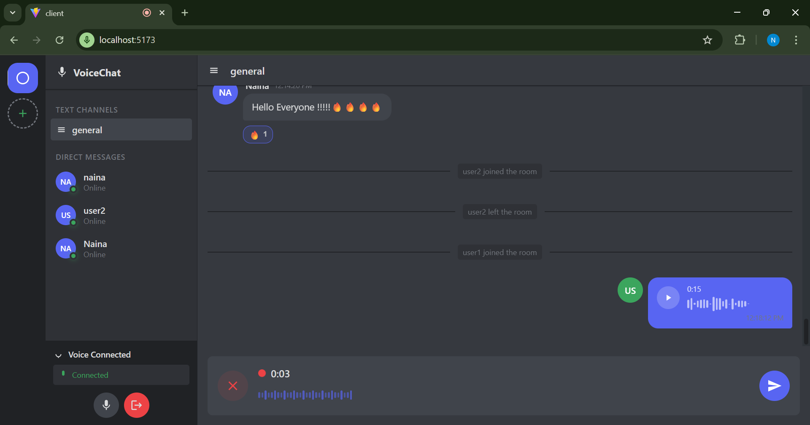
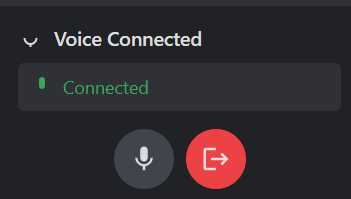
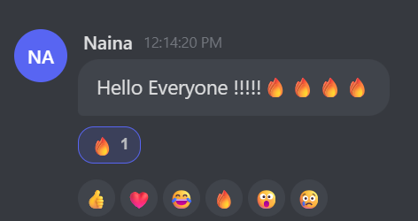

# Realtime Voice Chat System

> A full-stack real-time chat and voice communication platform with text chat, voice messages, and live voice streaming. 

[](https://nodejs.org/)
[](https://socket.io/)
[](https://reactjs.org/)
[](https://redis.io/)
[](LICENSE)

## Overview

A production-ready real-time voice chat system built with Socket.IO, Redis, React, and Node.js. Create or join chat rooms, send text and voice messages, and participate in live voice conversations with microphone controls. Built with clean MVC architecture, focusing on scalability and real-time performance.

**Key Features:**
- Multiple chat rooms with live user counts and presence tracking
- Real-time text messaging with persistent chat history
- Voice messages with Base64 encoding and playback amplification
- Live voice streaming with mute/unmute controls
- **1-on-1 Voice Calls (WebRTC in DMs)** - Start a direct voice call with any user from Direct Messages. Includes ringing UI, accept/reject, mute/unmute, live call timer, and clean call teardown on end/disconnect.
- Direct (1-on-1) private messaging
- Emoji reactions on messages
- Redis-backed scalability for horizontal scaling
- Graceful connection/disconnection handling
- System notifications for user events

**Why This Application?**
- **Real-time everything** - Instant voice, text, and presence updates via WebSockets
- **Flexible communication** - Three communication modes in one platform
- **Scalable architecture** - Redis state management enables multi-instance deployment
- **Production-ready** - Proper error handling, clean code structure, comprehensive features
- **No authentication needed** - Quick access for testing and demos

## Quick Start

### Prerequisites
- Node.js 20+, npm 9+, Docker

### Installation

```bash
# 1. Clone repository
git clone https://github.com/NainaKothari-14/Realtime-Voice-Chat-System.git
cd Realtime-Voice-Chat-System

# 2. Start Redis
docker run -d --name redis-voice -p 6379:6379 redis:7

# 3. Server setup
cd server
npm install
npm run dev  # Runs at http://localhost:5000

# 4. Client setup (new terminal)
cd client
npm install
npm run dev  # Runs at http://localhost:5173
```

### Test the App
1. Open `http://localhost:5173`
2. Enter username → Join/Create room
3. Allow microphone access
4. Start chatting!

## Table of Contents

- [Why Realtime Voice Chat System](#why-realtime-voice-chat-system)
- [Features](#features)
- [Architecture](#architecture)
- [Tech Stack](#tech-stack)
- [Installation Guide](#installation-guide)
  - [Prerequisites](#prerequisites-1)
  - [Step-by-Step Setup](#step-by-step-setup)
  - [Verify Installation](#verify-installation)
- [How It Works](#how-it-works)
  - [Voice Messages Implementation](#voice-messages-implementation)
  - [Live Voice Streaming](#live-voice-streaming)
  - [1-on-1 Voice Calls (WebRTC + Socket.IO Signaling)](#1-on-1-voice-calls-webrtc--socketio-signaling)
  - [Room System](#room-system)
  - [Direct Messaging](#direct-messaging)
- [API Reference](#api-reference)
  - [REST Endpoints](#rest-endpoints)
  - [Socket.IO Events](#socketio-events)
- [Configuration](#configuration)
- [Screenshots](#screenshots)
- [Deployment](#deployment)
  - [Docker Compose Deployment](#docker-compose-deployment)
  - [Traditional Hosting](#traditional-hosting)
  - [Security Best Practices](#security-best-practices)
- [Troubleshooting](#troubleshooting)
  - [Microphone Issues](#microphone-not-working)
  - [Voice Playback Issues](#voice-messages-not-playing)
  - [Redis Connection](#redis-connection-errors)
  - [Socket Disconnections](#socket-disconnections)
  - [Common Issues](#users-not-appearing-in-room)
- [Key Learnings](#key-learnings)
- [Roadmap](#roadmap)
  - [Future Improvements](#future-improvements)
- [Contributing](#contributing)
- [License](#license)
- [Acknowledgments](#acknowledgments)

## Why Realtime Voice Chat System

Realtime Voice Chat System provides a complete communication platform that combines the immediacy of voice with the convenience of text messaging. Built with modern web technologies and enterprise-grade architecture, it demonstrates best practices in real-time system design.

**Key Benefits:**
- **Multi-Modal Communication** - Text, voice messages, and live voice streaming in one platform
- **Real-Time Everything** - Instant voice, text, and presence updates via WebSockets
- **Scalable Architecture** - Redis state management enables horizontal scaling across multiple server instances
- **Production-Ready** - Comprehensive error handling, clean MVC code structure, graceful disconnection handling
- **Developer-Friendly** - No authentication barriers for quick testing and demos
- **Enterprise Features** - Room management, presence tracking, direct messaging, reactions

**Perfect For:**
- Team collaboration and remote communication
- Virtual events and conferences
- Gaming communities and social platforms
- Customer support and live assistance
- Online education and virtual classrooms
- Any application requiring real-time voice/text interaction

## Features

### Communication Modes

- **Text Messaging** - Real-time chat with persistent history stored in Redis
- **Voice Messages** - Record, send, and playback audio messages with volume amplification
- **Live Voice Streaming** - Continuous voice communication with microphone controls
- **1-on-1 Voice Calls (WebRTC in DMs)** - Start a direct voice call with any user from Direct Messages. Includes ringing UI, accept/reject, mute/unmute, live call timer, and clean call teardown on end/disconnect.
- **Direct Messaging** - Private 1-on-1 conversations between users
- **Emoji Reactions** - React to messages with emoji for quick responses

### Room Features

- **Multiple Chat Rooms** - Pre-configured rooms (General, Music, Gaming) and custom room creation
- **Live User Counts** - Real-time display of active users in each room
- **Presence Tracking** - Redis-backed system showing who's online
- **Room History** - Chat history automatically loaded when joining rooms
- **System Notifications** - Automatic announcements for user join/leave events

### Technical Features

- **WebSocket Communication** - Bidirectional real-time data flow using Socket.IO
- **WebRTC Integration** - Peer-to-peer voice calls with Socket.IO signaling
- **Redis Persistence** - Chat history and user presence stored in Redis
- **Graceful Disconnections** - Intelligent handling prevents duplicate notifications
- **Audio Enhancement** - Echo cancellation, noise suppression, auto gain control
- **Volume Amplification** - 2x-4x playback boost for voice messages using Web Audio API
- **Cross-Platform** - Works on Windows, macOS, Linux, and modern mobile browsers

### User Experience

- **Instant Updates** - Zero-latency message delivery and user list updates
- **Clean Interface** - Intuitive React-based UI with responsive design
- **Microphone Controls** - Easy mute/unmute toggle for live voice
- **Call Controls** - Accept/reject incoming calls, end active calls, view call duration
- **Visual Feedback** - Real-time indicators for recording, sending, playing audio
- **Error Handling** - Clear user feedback for connection issues and errors

## Architecture

### System Architecture

```
┌─────────────────┐
│  Client (React) │
│   - UI Layer    │
│   - Socket.IO   │
│   - Audio APIs  │
│   - WebRTC      │
└────────┬────────┘
         │
         │ WebSocket (Socket.IO)
         │ WebRTC (P2P Audio)
         │
         ▼
┌─────────────────────────┐
│  Server (Node.js)       │
│   - Express Routes      │
│   - Socket Controllers  │
│   - WebRTC Signaling    │
│   - Services Layer      │
└────────┬────────────────┘
         │
         │ Real-time state
         │ Pub/Sub messaging
         │
         ▼
┌─────────────────┐
│     Redis       │
│  - Room state   │
│  - User presence│
│  - Chat history │
└─────────────────┘
```

**Data Flow:**  
User Action → Socket Event → Controller → Service → Store/Redis → Broadcast to Clients

**Example: User Joins Room**
1. User clicks "Join Room" → Client emits `room:join` event
2. Server's `roomSocketController` receives event
3. `joinRoom` service updates user list in memory
4. `setOnline` updates user presence in Redis
5. `updateRoomUserCount` updates room statistics
6. Server broadcasts `room:users` and `rooms:list` to all connected clients
7. New user receives `chat:history` with previous messages
8. System message broadcasted: "User joined the room"

**Core Components:**
- **Room Management:** Join/create rooms, live user counts, presence tracking, graceful leave handling
- **Text Messaging:** Real-time chat, Redis-backed history persistence, system notifications
- **Voice Messages:** Record → Base64 encode → Broadcast → Playback with Web Audio amplification (2x-4x)
- **Live Voice:** Microphone streaming via Socket.IO with mute/unmute controls and automatic cleanup
- **1-on-1 Calls:** WebRTC peer-to-peer connections with Socket.IO signaling, call state management, ringing/timeout handling

## Tech Stack

**Frontend:** React 18, Vite, Socket.IO Client, Web Audio API, MediaRecorder API, WebRTC  
**Backend:** Node.js, Express, Socket.IO, Redis 
**DevOps:** Docker, Git

## Screenshots

<table>
  <tr>
    <td width="50%">
      
      <p align="center"><em>User Entry Page</em></p>
    </td>
    <td width="50%">
      
      <p align="center"><em>Select/Create Room</em></p>
    </td>
  </tr>
  <tr>
    <td width="50%">
      
      <p align="center"><em>Multiple Active Rooms</em></p>
    </td>
    <td width="50%">
      
      <p align="center"><em>Chat Room Interface</em></p>
    </td>
  </tr>
  <tr>
    <td width="50%">
      
      <p align="center"><em>Direct Messaging</em></p>
    </td>
    <td width="50%">
      
      <p align="center"><em>Voice Messages</em></p>
    </td>
  </tr>
  <tr>
    <td width="50%">
      
      <p align="center"><em>Mic Controls & Exit</em></p>
    </td>
    <td width="50%">
      
      <p align="center"><em>Emoji Reactions</em></p>
    </td>
  </tr>
  <tr>
    <td width="50%">
      
      <p align="center"><em>Call Message/Request</em></p>
    </td>
    <td width="50%">
      
      <p align="center"><em>Outgoing Call - Ringing</em></p>
    </td>
  </tr>
  <tr>
    <td width="50%">
      
      <p align="center"><em>Call Accepted - Incoming</em></p>
    </td>
    <td width="50%">
      
      <p align="center"><em>Ongoing Call - Active</em></p>
    </td>
  </tr>
</table>

## How It Works

### Voice Messages Implementation

**Recording Flow:**
```javascript
// 1. Request microphone access
const stream = await navigator.mediaDevices.getUserMedia({ audio: true });

// 2. Record audio chunks
const mediaRecorder = new MediaRecorder(stream);
const audioChunks = [];

mediaRecorder.ondataavailable = (event) => {
  audioChunks.push(event.data);
};

mediaRecorder.onstop = () => {
  const audioBlob = new Blob(audioChunks, { type: 'audio/webm' });
  // Convert to Base64 and send via Socket.IO
};
```

**Server Broadcasting:**
```javascript
socket.on('chat:send:voice', async ({ roomId, audio }) => {
  const message = {
    id: generateId(),
    type: 'voice',
    audio: audio, // Base64 string
    user: socket.data.user.name,
    createdAt: Date.now()
  };
  
  await addChat(roomId, message);
  io.to(roomId).emit('chat:message', message);
});
```

**Playback with Amplification:**
```javascript
// Decode and amplify audio using Web Audio API
const audioContext = new AudioContext();
const gainNode = audioContext.createGain();
gainNode.gain.value = 3.0; // 3x volume boost

source.connect(gainNode);
gainNode.connect(audioContext.destination);
source.start();
```

> ⚠️ **Production Note:** This implementation uses Base64 for simplicity. For production:
> - Store audio in cloud storage (AWS S3, Cloudinary)
> - Share via secure URLs instead of Base64
> - Compress audio files for bandwidth optimization
> - Implement caching for faster playback

### Live Voice Streaming

**Connection Setup:**
```javascript
// 1. Join room
socket.emit('room:join', { roomId, user: { name } });

// 2. Capture microphone with audio enhancements
const stream = await navigator.mediaDevices.getUserMedia({ 
  audio: {
    echoCancellation: true,
    noiseSuppression: true,
    autoGainControl: true
  } 
});

// 3. Mute/Unmute controls
stream.getAudioTracks()[0].enabled = false; // Mute
stream.getAudioTracks()[0].enabled = true;  // Unmute

// 4. Cleanup on leave
stream.getTracks().forEach(track => track.stop());
socket.emit('room:leave');
```

**How It Works:**
- Audio stream captured from user's microphone
- Stream chunks sent via Socket.IO to server
- Server broadcasts to all room members
- Received on other clients and played in real-time
- Automatic cleanup on disconnect prevents duplicate notifications

### 1-on-1 Voice Calls (WebRTC + Socket.IO Signaling)

This project supports **direct voice calling inside DMs** using WebRTC.  
Socket.IO is used for signaling (exchange offers/answers + ICE candidates), while audio streams travel peer-to-peer via WebRTC.

**Call Flow:**
1. Caller sends `call:request`
2. Receiver gets `call:incoming` → **Accept / Reject**
3. If accepted → caller sends `webrtc:offer`
4. Receiver replies with `webrtc:answer`
5. Both exchange `webrtc:ice` candidates
6. Connection becomes `connected` → timer starts
7. Call ends with `call:end` → cleanup (tracks stopped, PC closed)

**Features included:**
- Ringing state + timeout (auto end if no answer)
- Accept / Reject controls
- Mute / Unmute during call
- Call duration timer
- Graceful cleanup on disconnect

**Implementation Example:**
```javascript
// Initialize WebRTC peer connection
const peerConnection = new RTCPeerConnection({
  iceServers: [{ urls: 'stun:stun.l.google.com:19302' }]
});

// Add local audio stream
localStream.getTracks().forEach(track => {
  peerConnection.addTrack(track, localStream);
});

// Handle incoming remote stream
peerConnection.ontrack = (event) => {
  remoteAudio.srcObject = event.streams[0];
};

// Send ICE candidates to peer via Socket.IO
peerConnection.onicecandidate = (event) => {
  if (event.candidate) {
    socket.emit('webrtc:ice', { to: peerId, candidate: event.candidate });
  }
};

// Create and send offer
const offer = await peerConnection.createOffer();
await peerConnection.setLocalDescription(offer);
socket.emit('webrtc:offer', { to: peerId, offer });
```

### Room System

**Features:**
- **Pre-configured Rooms:** General, Music, Gaming rooms ready to join
- **Custom Rooms:** Create rooms with custom names and emoji icons
- **Live User Count:** Real-time updates across all clients when users join/leave
- **Presence Tracking:** Redis-backed system tracks who's online
- **Graceful Handling:** `leftManually` flag prevents duplicate leave notifications

**Room Lifecycle:**
1. User joins → Added to room user list
2. Presence updated in Redis
3. User count broadcasted to all clients
4. Chat history sent to new user
5. System message: "User joined"
6. On leave → Reverse process with cleanup

## API Reference

### REST Endpoints

**Get Active Rooms**
```http
GET http://localhost:5000/api/rooms
```

**Response:**
```json
{
  "rooms": [
    {
      "id": "general",
      "name": "General",
      "icon": "💬",
      "users": 5
    },
    {
      "id": "music",
      "name": "Music",
      "icon": "🎵",
      "users": 3
    }
  ]
}
```

### Socket.IO Events

#### Client → Server Events

**Room & Chat Events**

| Event | Description | Payload |
|-------|-------------|---------|
| `room:join` | Join a room | `{ roomId, user: { name } }` |
| `room:leave` | Leave current room | None |
| `chat:message` | Send text message | `{ roomId, text, user }` |
| `chat:send:voice` | Send voice message | `{ roomId, audio, user }` |
| `chat:direct` | Send direct message | `{ to, text, user }` |
| `chat:reaction` | React to message | `{ messageId, emoji, user }` |

**Call Events**

| Event | Description | Payload |
|-------|-------------|---------|
| `call:request` | Start a call request | `{ to }` |
| `call:accept` | Accept incoming call | `{ to }` |
| `call:reject` | Reject incoming call | `{ to }` |
| `call:end` | End active call | `{ to, duration }` |
| `call:timeout` | Call not answered | `{ to }` |
| `webrtc:offer` | Send WebRTC offer | `{ to, offer }` |
| `webrtc:answer` | Send WebRTC answer | `{ to, answer }` |
| `webrtc:ice` | Send ICE candidate | `{ to, candidate }` |

**Example Usage:**
```javascript
// Join a room
socket.emit('room:join', {
  roomId: 'general',
  user: { name: 'Alice' }
});

// Send a text message
socket.emit('chat:message', {
  roomId: 'general',
  text: 'Hello everyone!',
  user: { name: 'Alice' }
});

// Send a voice message
socket.emit('chat:send:voice', {
  roomId: 'general',
  audio: base64AudioString,
  user: { name: 'Alice' }
});

// Start a 1-on-1 call
socket.emit('call:request', { to: 'Bob' });

// Accept incoming call
socket.on('call:incoming', ({ from }) => {
  socket.emit('call:accept', { to: from });
});
```

#### Server → Client Events

**Room & Chat Events**

| Event | Description | Data |
|-------|-------------|------|
| `room:users` | Updated user list in room | `[{ name }, { name }, ...]` |
| `rooms:list` | Updated list of all rooms | `[{ id, name, icon, users }, ...]` |
| `chat:history` | Chat history on join | `[{ id, type, text/audio, user, createdAt }, ...]` |
| `chat:message` | New message received | `{ id, roomId, type, text/audio, user, createdAt }` |
| `chat:direct:received` | Direct message received | `{ from, text, createdAt }` |
| `chat:reaction:update` | Reaction counts updated | `{ messageId, reactions }` |

**Call Events**

| Event | Description | Data |
|-------|-------------|------|
| `call:incoming` | Incoming call notification | `{ from }` |
| `call:accepted` | Receiver accepted call | `{ from }` |
| `call:rejected` | Receiver rejected call | `{ from }` |
| `call:ended` | Call ended | `{ from, duration }` |
| `call:timeout` | Call timed out | `{ from }` |
| `call:unavailable` | User unavailable | `{ to }` |

**Example Listeners:**
```javascript
// Listen for user list updates
socket.on('room:users', (users) => {
  console.log('Users in room:', users);
  updateUserList(users);
});

// Listen for new messages
socket.on('chat:message', (message) => {
  if (message.type === 'voice') {
    playVoiceMessage(message.audio);
  } else {
    displayTextMessage(message);
  }
});

// Listen for chat history
socket.on('chat:history', (messages) => {
  messages.forEach(msg => displayMessage(msg));
});

// Listen for incoming calls
socket.on('call:incoming', ({ from }) => {
  showIncomingCallUI(from);
});

// Listen for WebRTC signaling
socket.on('webrtc:offer', async ({ from, offer }) => {
  await peerConnection.setRemoteDescription(offer);
  const answer = await peerConnection.createAnswer();
  await peerConnection.setLocalDescription(answer);
  socket.emit('webrtc:answer', { to: from, answer });
});
```

## Configuration

**Server `.env`:**
```env
PORT=5000
NODE_ENV=development
CLIENT_URL=http://localhost:5173
REDIS_URL=redis://localhost:6379
```

**Client `.env`:**
```env
VITE_SERVER_URL=http://localhost:5000
```

## Troubleshooting

### Microphone Not Working

**Browser Permissions:**
1. Look for microphone icon in browser address bar
2. Click and select "Allow"
3. Refresh the page if needed

**Common Issues:**
- Browser doesn't support MediaRecorder API (use Chrome/Firefox/Edge)
- HTTPS required for microphone access (localhost is exempted)
- Microphone is being used by another application
- Hardware or driver issues

**Debug:**
```javascript
navigator.mediaDevices.getUserMedia({ audio: true })
  .then(stream => {
    console.log('✅ Microphone access granted');
    console.log('Audio tracks:', stream.getAudioTracks());
  })
  .catch(err => {
    console.error('❌ Microphone error:', err.name, err.message);
  });
```

### Voice Messages Not Playing

**Check Audio Format:**
```javascript
// Ensure Base64 includes proper prefix
console.log('Audio format:', audioBase64.substring(0, 30));
// Should start with: "data:audio/webm;base64,"
```

**Common Fixes:**
- Verify Base64 string includes `data:audio/webm;base64,` prefix
- Check browser audio codec support (WebM/Opus)
- Verify volume amplification isn't causing distortion
- Test with headphones to rule out speaker issues

### Redis Connection Errors

**ECONNREFUSED Error:**
```bash
# Check if Redis is running
docker ps | grep redis-voice

# If not running, start Redis
docker run -d --name redis-voice -p 6379:6379 redis:7

# Verify connection
redis-cli ping  # Should return "PONG"
```

**Connection Timeout:**
```bash
# Check Redis logs
docker logs redis-voice

# Verify port is exposed
netstat -an | grep 6379

# Check firewall settings
sudo ufw status
```

**Server-side Debug:**
```javascript
// Add error handling in server
redis.on('error', (err) => {
  console.error('Redis error:', err);
});

redis.on('connect', () => {
  console.log('✅ Connected to Redis');
});
```

### Socket Disconnections

**Enable Client-side Debugging:**
```javascript
const socket = io('http://localhost:5000', {
  reconnection: true,
  reconnectionDelay: 1000,
  reconnectionAttempts: 5
});

socket.on('connect', () => {
  console.log('✅ Connected:', socket.id);
});

socket.on('disconnect', (reason) => {
  console.log('❌ Disconnected:', reason);
  if (reason === 'io server disconnect') {
    socket.connect(); // Manually reconnect
  }
});

socket.on('reconnect', (attemptNumber) => {
  console.log(`✅ Reconnected after ${attemptNumber} attempts`);
});

socket.on('connect_error', (error) => {
  console.error('Connection error:', error.message);
});
```

**Common Causes:**
- Network interruptions or unstable connection
- Server restart or crash
- CORS misconfiguration
- Browser tab suspended (mobile browsers)
- Firewall blocking WebSocket connections

### Users Not Appearing in Room

**Debug Checklist:**
```javascript
// 1. Verify socket connection
console.log('Socket connected:', socket.connected);
console.log('Socket ID:', socket.id);

// 2. Check room join acknowledgment
socket.emit('room:join', { roomId, user }, (ack) => {
  console.log('Join acknowledged:', ack);
});

// 3. Verify event listeners are set up
socket.on('room:users', (users) => {
  console.log('✅ Received user list:', users);
});

// 4. Check server logs
// Server should log: "User [name] joined room [roomId]"
```

### Duplicate Leave Notifications

**Solution:** The `leftManually` flag prevents this:
```javascript
// When user clicks leave button
socket.on('room:leave', async () => {
  socket.data.leftManually = true; // Set flag
  // ... cleanup logic
});

// On browser close/refresh
socket.on('disconnecting', async () => {
  if (socket.data.leftManually) return; // Skip if already handled
  // ... handle disconnection
});
```

### Chat History Not Loading

**Check Redis Data:**
```bash
# Connect to Redis CLI
redis-cli

# List all chat keys
KEYS chat:*

# View specific room history
GET chat:general
```

**Verify Server Code:**
```javascript
socket.on('room:join', async ({ roomId, user }) => {
  const history = await getChatHistory(roomId);
  console.log(`Sending ${history.length} messages to ${user.name}`);
  socket.emit('chat:history', history);
});
```

## Deployment

### Docker Compose Deployment

```yaml
version: '3.8'

services:
  redis:
    image: redis:7-alpine
    ports:
      - "6379:6379"
    volumes:
      - redis-data:/data
    restart: unless-stopped
    command: redis-server --appendonly yes

  server:
    build: ./server
    ports:
      - "5000:5000"
    environment:
      - NODE_ENV=production
      - PORT=5000
      - REDIS_URL=redis://redis:6379
      - CLIENT_URL=https://your-domain.com
    depends_on:
      - redis
    restart: unless-stopped

  client:
    build: ./client
    ports:
      - "80:80"
    environment:
      - VITE_SERVER_URL=https://api.your-domain.com
    restart: unless-stopped

volumes:
  redis-data:
```

**Deploy:**
```bash
docker-compose up -d          # Start services
docker-compose logs -f        # View logs
docker-compose down           # Stop services
```

### Traditional Hosting

**Deploy to VPS (DigitalOcean, AWS EC2, Linode):**

```bash
# Install PM2 for process management
npm install -g pm2

# Start backend
cd server
pm2 start index.js --name voice-chat-server

# Build and serve frontend
cd client
npm run build
npm install -g serve
serve -s dist -l 80
```

**Nginx Configuration:**

```nginx
server {
    listen 80;
    server_name yourdomain.com;

    location /socket.io {
        proxy_pass http://localhost:5000;
        proxy_http_version 1.1;
        proxy_set_header Upgrade $http_upgrade;
        proxy_set_header Connection 'upgrade';
        proxy_set_header Host $host;
        proxy_cache_bypass $http_upgrade;
    }

    location /api {
        proxy_pass http://localhost:5000;
        proxy_http_version 1.1;
        proxy_set_header Host $host;
    }

    location / {
        root /var/www/voice-chat/dist;
        try_files $uri /index.html;
    }
}
```

### Security Best Practices

**1. Rate Limiting**
```bash
npm install express-rate-limit
```

```javascript
import rateLimit from 'express-rate-limit';

const limiter = rateLimit({
  windowMs: 15 * 60 * 1000,  // 15 minutes
  max: 100,                   // 100 requests per window
  message: 'Too many requests from this IP'
});

app.use('/api/', limiter);
```

**2. Security Headers (Helmet)**
```bash
npm install helmet
```

```javascript
import helmet from 'helmet';

app.use(helmet({
  contentSecurityPolicy: {
    directives: {
      defaultSrc: ["'self'"],
      connectSrc: ["'self'", "wss:", "https:"]
    }
  }
}));
```

**3. Input Validation**
```javascript
socket.on('room:join', async ({ roomId, user }) => {
  const name = user?.name?.trim();
  
  if (!name || name.length < 2 || name.length > 20) {
    socket.emit('error', { message: 'Username must be 2-20 characters' });
    return;
  }
  
  if (!/^[a-zA-Z0-9_\s]+$/.test(name)) {
    socket.emit('error', { message: 'Invalid characters in username' });
    return;
  }
});
```

**4. Environment-based CORS**
```javascript
const allowedOrigins = process.env.NODE_ENV === 'production'
  ? [process.env.CLIENT_URL]
  : ['http://localhost:5173', 'http://localhost:3000'];

app.use(cors({
  origin: (origin, callback) => {
    if (!origin || allowedOrigins.includes(origin)) {
      callback(null, true);
    } else {
      callback(new Error('Not allowed by CORS'));
    }
  },
  credentials: true
}));
```

## Key Learnings

### Real-Time Systems
- WebSocket-based bidirectional communication with Socket.IO
- Redis for shared state management across server instances
- Event-driven architecture for instant updates
- Handling edge cases (disconnections, duplicate events)

### Audio Processing in Browsers
- MediaRecorder API for capturing audio
- Base64 encoding for simple transport (not ideal for production)
- Web Audio API for volume amplification
- Managing microphone permissions and user consent

### WebRTC Integration
- Peer-to-peer connection establishment using RTCPeerConnection
- Socket.IO as signaling channel for offer/answer/ICE exchange
- Managing call states (idle, ringing, connected, ended)
- Graceful cleanup of media streams and peer connections
- Handling network transitions and reconnections

### Clean Architecture
- MVC pattern for organized, maintainable code
- Service layer for business logic separation
- Hybrid storage: In-Memory for speed + Redis for persistence
- Controller separation by domain (room, chat, voice, calls)

### User Experience
- Graceful disconnection with `leftManually` flag
- Real-time presence tracking across clients
- Chat history loading on room join
- System notifications for user events
- Call state management with timeout handling

## Roadmap

### Future Improvements

#### Storage & Media
- [ ] Store voice messages in cloud storage (AWS S3, Cloudinary)
- [ ] Implement message retention policies
- [ ] Add message edit/delete functionality
- [ ] Support file sharing (images, documents)
- [ ] Audio compression before upload

#### Authentication & Security
- [ ] User authentication (JWT/OAuth)
- [ ] Private rooms with password protection
- [ ] User roles and permissions (admin, moderator)
- [ ] Rate limiting for messages and voice uploads
- [ ] End-to-end encryption for messages

#### Features
- [ ] Typing indicators ("User is typing...")
- [ ] Message read receipts and delivery status
- [ ] @mentions and push notifications
- [ ] User profiles with avatars and status
- [ ] Voice chat recording/playback
- [ ] Screen sharing capability
- [ ] Message search functionality
- [ ] Group voice calls (multi-party WebRTC)
- [ ] Call history and missed call notifications

#### Performance & Scalability
- [ ] Redis Pub/Sub for multi-instance deployment
- [ ] Message pagination and lazy loading
- [ ] Implement caching strategies
- [ ] CDN integration for static assets
- [ ] TURN server for NAT traversal
- [ ] WebRTC connection quality monitoring

#### Mobile & PWA
- [ ] Responsive mobile design
- [ ] Progressive Web App (PWA) support
- [ ] Push notifications for new messages
- [ ] Offline message queueing
- [ ] Native mobile app (React Native)

#### DevOps & Monitoring
- [ ] CI/CD pipeline (GitHub Actions)
- [ ] Monitoring and logging (Sentry, DataDog)
- [ ] Performance metrics dashboard
- [ ] Automated testing (unit, integration, e2e)
- [ ] Load testing and optimization

## Contributing

Contributions welcome! To contribute:

1. Fork the repository
2. Create a feature branch (`git checkout -b feature/amazing-feature`)
3. Commit your changes (`git commit -m 'Add amazing feature'`)
4. Push to branch (`git push origin feature/amazing-feature`)
5. Open a Pull Request

**Development Guidelines:**
- Follow existing code style and patterns
- Write meaningful commit messages
- Add comments for complex logic
- Test changes locally before submitting
- Update documentation as needed

## License

This project is licensed under the **MIT License** - see the [LICENSE](LICENSE) file for details.

### What This Means

- ✅ Use in private and commercial projects
- ✅ Modify and distribute
- ✅ Sublicense
- ❌ Hold author liable
- ⚠️ Include original copyright notice

## Author

**Naina Kothari**  
GitHub: [@NainaKothari-14](https://github.com/NainaKothari-14)

## Acknowledgments

**Technologies:**
- **[Socket.IO](https://socket.io/)** - Real-time bidirectional communication
- **[Redis](https://redis.io/)** - In-memory data structure store
- **[React](https://react.dev/)** - UI library
- **[Vite](https://vitejs.dev/)** - Fast build tool
- **[Node.js](https://nodejs.org/)** - JavaScript runtime
- **[WebRTC](https://webrtc.org/)** - Peer-to-peer real-time communication

**Inspiration:**
- Modern real-time communication platforms
- WebSocket and event-driven architecture
- Developer-friendly APIs
- Open source community

## Support

If you have questions or need help:

- Open an [issue](https://github.com/NainaKothari-14/Realtime-Voice-Chat-System/issues)
- Start a [discussion](https://github.com/NainaKothari-14/Realtime-Voice-Chat-System/discussions)
- Star this repo if you find it helpful!

---

## Get Involved

If this project helps you, please consider:

- ⭐ **Starring the repository** on GitHub
- 🐛 **Reporting bugs** you encounter
- 💡 **Suggesting features** you'd like to see
- 🔧 **Contributing code** improvements
- 📖 **Improving documentation** for other users
- 📢 **Sharing** with others who might benefit

[](https://github.com/NainaKothari-14/Realtime-Voice-Chat-System)

---

**❤️ Built with Socket.IO, Redis, React, WebRTC, and Node.js**

*If this project helps you, consider giving it a star ⭐!*
